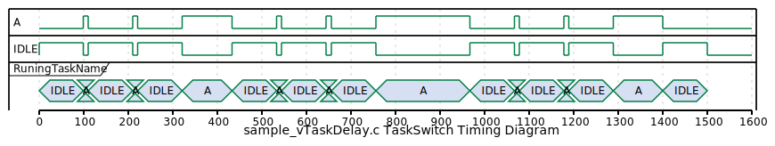

# 1_vTaskDelay

vTaskDelay()を使う練習

## How to Run

```sh
cmake -S . -B build
cd build
make
ctest
./freertos_training_vTaskDelay
```

## Memo

vTaskDelay() 引数で指定した時間(tick)分Block状態にする。
呼び出したところから起動するまでの相対時間を指定。


