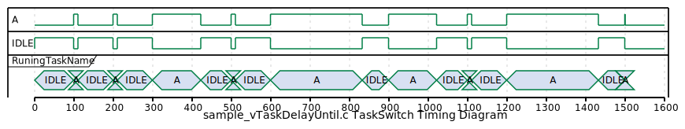

# 2_vTaskDelayUntil

vTaskDelayUntil()を使う練習

## How to Run

```sh
cmake -S . -B build
cd build
make
ctest
./freertos_training_vTaskDelayUntil
```

## Memo

Block状態を解除する時刻(tick)を指定する。
すでに過ぎた時刻を指定するとBlock状態にならずにreturnしてくる。


