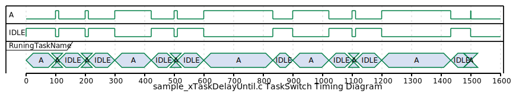

# 3_xTaskDelayUntil

xTaskDelayUntil()を使う練習

## How to Run

```sh
cmake -S . -B build
cd build
make
ctest
./freertos_training_xTaskDelayUntil
```

## Memo

Block状態を解除する時刻(tick)を指定する。
すでに過ぎた時刻を指定するとBlock状態にならずにreturnしてくる。
Block状態になったかどうかで戻り値が異なる。

基本的には定期的に処理したいが、
優先度の高い処理忙しくてCPU回ってこない時は処理スキップしたいを
実現するときに使えってことかな


